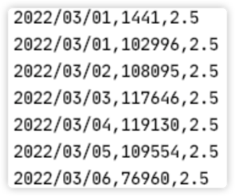
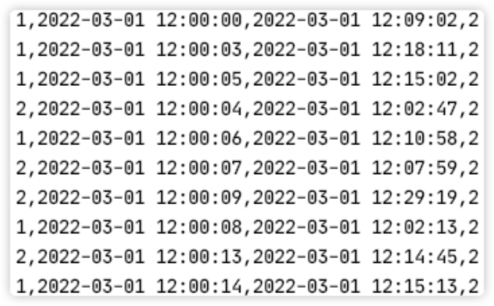

# Yellow Taxi and Limousine Commission Trips

## Description

New York Taxi and Limousine Commission stores all trips done by yellow and green taxis. This data is reported by each taxi and is sent to a data center that processes this information for different purposes.

Each taxi reports all the information regarding each trip with the following information: `VendorID`, `tpep_pickup_datetime`, `tpep_dropoff_datetime`, `passenger_count`, `trip_distance`, `RatecodeID`, `store_and_fwd_flag`, `PULocationID`, `DOLocationID`, `payment_type`, `fare_amount`, `extra`, `mta_tax`, `tip_amount`, `tolls_amount`, `improvement_surcharge`, `total_amount`, `congestion_surcharge`, `airport_fee`.

- `VendorID`: A code indicating the TPEP provider that provided the record. 1 = Creative Mobile Technologies, LLC; 2 = VeriFone Inc...
- `tpep_pickup_datetime`: The date and time when the meter was engaged.
- `tpep_dropoff_datetime`: The date and time when the meter was disengaged.
- `passenger_count`: The number of passengers in the vehicle. This is a driver-entered value.
- `trip_distance`: The elapsed trip distance in miles reported by the taximeter.
- `RatecodeID`: The final rate code in effect at the end of the trip. 1 = Standard rate; 2 = JFK; 3 = Newark; 4 = Nassau or Westchester; 5 = Negotiated fare; 6 = Group ride.
- `store_and_fwd_flag`: This flag indicates whether the trip record was held in the vehicle memory before sending it to the vendor, aka “store and forward”, because the vehicle did not have connection to the server. Y= store and forward trip; N= not a store and forward trip.
- `PULocationID`: TLC Taxi Zone in which the taximeter was engaged.
- `DOLocationID`: TLC Taxi Zone in which the taximeter was disengaged.
- `payment_type`: A numeric code signifying how the passenger paid for the trip. 1 = Credit card; 2 = Cash; 3 = No charge; 4 = Dispute; 5 = Unknown; 6 = Voided trip.
- `fare_amount`: The time-and-distance fare calculated by the meter.
- `Extra`:  Miscellaneous extras and surcharges. Currently, this only includes the $0.50 and $1 rush hour and overnight charges.
- `mta_tax`: $0.50 MTA tax that is automatically triggered based on the metered rate in use.
- `tip_amount`: Tip amount – _This field is automatically populated for credit card tips. Cash tips are not included.
- `tolls_amount`: Total amount of all tolls paid in trip.
- `improvement_surcharge`: $0.30 improvement surcharge assessed trips at the flag drop. The improvement surcharge began being levied in 2015.
- `total_amount`: The total amount charged to passengers. It does not include cash tips.
- `congestion_surcharge`: The surcharge applied when the trip goes through a congested area.
- `airport_fee`: The fee applied to the trip when it starts or ends at an airport.

## Goal

The goal of this project is to develop two Java programs using Flink for implementing the following functionality:

### Congested Area -- 6 points

The commission wants to control the number of taxis accessing the most congested areas of the city, more concretely the commission is interested in knowing for each day, the number of trips accessing these areas and the average cost of the trips that go through these areas.

Each line in the output has this format:

```
Date, NumberOfTrips, CostAvg.
```

This is an example of the expected output (pay attention to the output format):


#### Notes:

1. The program name must be CongestedArea.
2. If the field congestion_surcharge has no value, replace it by 0.0.

### Saturated Vendor -- 4 points
The commission wants to register when a vendorID is saturated. A vendor is saturated when a trip starts in less than 10 minutes after the previous trip finished. 
If there are two or more consecutive trips from a vendor (a trip starts in less than 10 minutes after the previous trip finished), a tuple is generated with this information : vendorID, start of the first trip (`tpep_pickup_datetime`), finish time of the last trip, total number of consecutive trips.

An example of the expected output is (pay attention to the output format) :

#### Notes:
1. The program name must be SaturatedVendor.
2. If the field trip_distance has no value, replace it by 0.0.
